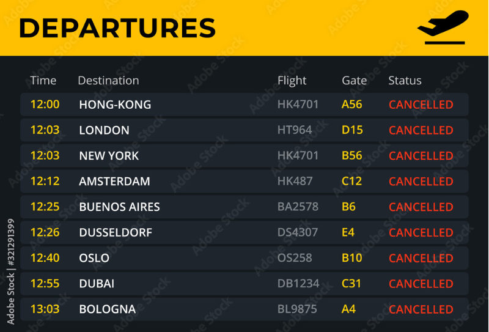

# JavaScript Airlines

<!-- markdownlint-disable no-inline-html -->
Use a mock data API with Flight Data to create an airport flight dashboard.

## Must Haves

- Create a new folder, initialize a git repository
- Create an `index.html` file (remember the shortcut to generate the boilerplate)
- Create a `scripts` or `js` folder and add your JavaScript file (i.e. a file named `scripts.js`, `main.js`, or `index.js`)
- Create a `styles` or `css` folder and add your Stylesheet (i.e. a file named `styles.css`, or `index.css`)
- **[OPTIONAL]** Use a CSS framework for added styling (i.e. [Bulma](https://bulma.io/documentation/start/installation/) or [Tailwind](https://tailwindcss.com/docs/installation/play-cdn))

## Choose Your Own Adventure

- Use `async/await` or `fetch().then().then()` (or both?)?
- Use arrow syntax, or `function` keyword syntax?
- Build the entire DOM in JavaScript (i.e. `createElement()`)?
- Lay out elements with IDs in the HTML (i.e. `querySelector()`)?

## JavaScript Airlines

### Level 1

- Use the following API endpoint: [https://my.api.mockaroo.com/flight_logs.json?key=5776e910](https://my.api.mockaroo.com/flight_logs.json?key=5776e910)
- Accept user input via a form that recieves any of the following flight plan data:
  - Airline <br/>Delta, American, or United
  - Flight Number
    - There are 200 flights total
    - First flight number is 115, the last is 9978
  - Airport ([Airport abbreviation available here](https://www.leonardsguide.com/us-airport-codes.shtml))
  - Departure/Arrival Dates<br/>For ease, these are strings in the following format: `2/8/2024` or `12/10/2023`
  - Departure/Arrival Times<br/>For ease, these are strings in the following format: `10:24 PM`
- Search for plan that matches the request data.
- Return that flight's information.
- Clear the form after returning data

The response from the Mock Flight Plan API will look like this:

```json
{
  "flight_number": 8423,
  "departure_airport": "MUK",
  "arrival_airport": "JAA",
  "departure_date": "2/13/2022",
  "arrival_date": "12/2/2022",
  "departure_time": "10:24 PM",
  "arrival_time": "2:57 AM",
  "passenger_count": 218,
  "airline": "Delta",
  "flight_duration": 9.46
}
```

### Level 2

- Generate an Arrival or Departure information board

|  |
|:--:|
| Use this board as a guide |

### Level 9000

- Cache the data in `localStorage`.
- Generate both Arrival _and_ Departure board
- Have the boards _switch_ periodically, like they do in an airport

:::tip
The [Intro to Promises lesson](/docs/lessons/building-interactive-uis/intro-to-promises/#how-do-you-write-a-function-that-returns-a-promise) will be helpful to understand caching in `localStorage`.

Look into CSS Animation, like [this Codepen demo](https://codepen.io/edeesims/pen/wvpYWW), to find options for switching the boards.
:::
